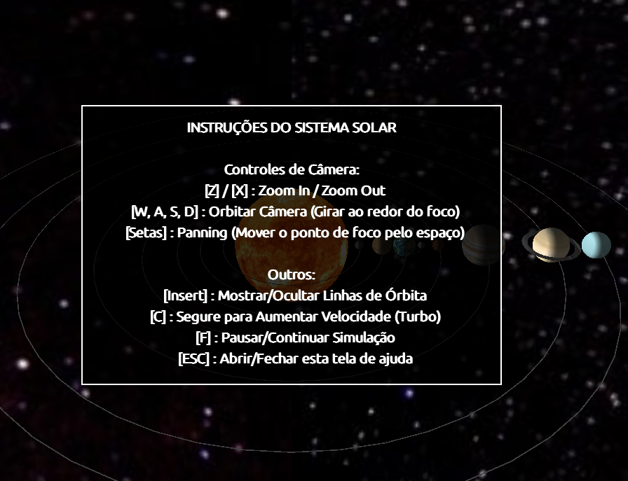
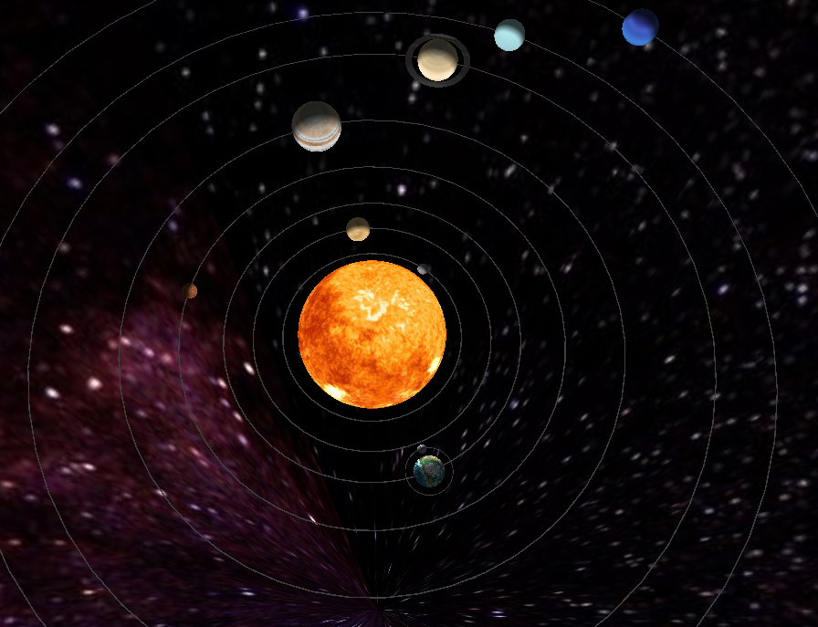

# Gilberto - Simulador do Sistema Solar

Este projeto é uma simulação 3D do Sistema Solar escrita em Python, utilizando **Pygame** e **PyOpenGL**.
Possui texturas de alta resolução, fundo espacial 3D (Sky Sphere), iluminação realista e controles de câmera livres.
 
## 📸 Galeria

| Visão Geral | Detalhes |
|---|---|
|  |  |

## 📋 Pré-requisitos

- Python 3.10 ou superior.
- Sistema Operacional Linux (testado), Windows ou macOS.

## 🚀 Instalação e Configuração

Devido às políticas de segurança de pacotes em sistemas Linux modernos, recomenda-se fortemente o uso de um **Ambiente Virtual (.venv)**.

### 1. Criar o Ambiente Virtual
Abra o terminal na pasta do projeto e execute:

```bash
python3 -m venv .venv
```

### 2. Ativar o Ambiente Virtual
Sempre que for trabalhar no projeto ou executá-lo, ative o ambiente:

```bash
# Linux / macOS
source .venv/bin/activate
```
*(Você verá `(.venv)` aparecer no início da linha de comando)*

### 3. Instalar Dependências
Com o ambiente ativado, instale as bibliotecas necessárias:

```bash
pip install -r requirements.txt
```

*(Caso precise instalar manualmente: `pip install pygame PyOpenGL PyOpenGL-accelerate`)*

## ▶️ Como Rodar

Certifique-se de que o ambiente virtual está ativo (passo 2) e execute o arquivo principal:

```bash
python main.py
```

Ou, se preferir executar diretamente sem ativar (comando único):

```bash
./.venv/bin/python main.py
```

## 🎮 Controles

| Tecla | Função |
|-------|--------|
| **Z** | **Zoom In** (Aproximar) |
| **X** | **Zoom Out** (Afastar) |
| **W, A, S, D** | **Orbitar** (Girar câmera ao redor do foco) |
| **Setas (Esq/Dir/Cima/Baixo)** | **Panning** (Mover o ponto de foco pelo espaço) |
| **C** | Segurar para **Turbo** (Acelerar Tempo) |
| **F** | **Pausar** / Continuar Simulação |
| **INSERT** | Mostrar/Ocultar **Linhas de Órbita** |
| **ESC** | Abrir/Fechar **Tela de Ajuda** e Instruções |

## 🛠️ Estrutura do Projeto

- `src/app/planetario.py`: Lógica principal da simulação 3D e renderização.
- `src/app/game.py`: Gerenciamento da janela Pygame e loop principal.
- `src/formas/primitivas.py`: Funções auxiliares para desenho 3D (esferas, anéis).
- `src/assets/textures/`: Imagens usadas para texturizar os planetas.
- `main.py`: Arquivo de entrada.

---
**Desenvolvido como exercício de Computação Gráfica.**
